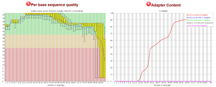
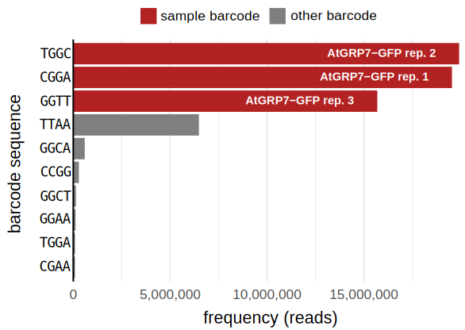
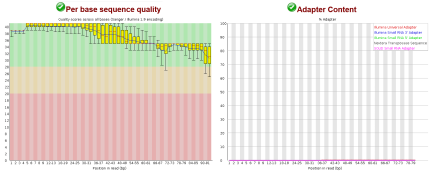
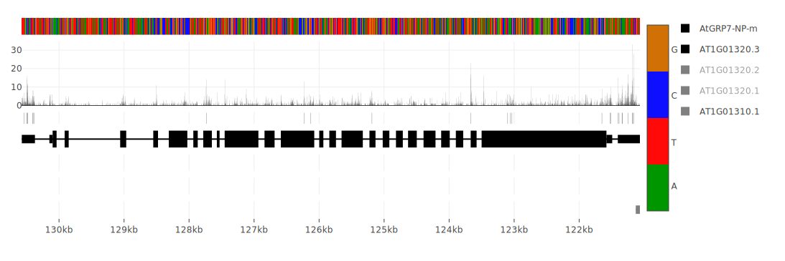

# README

## *Arabidopsis* iCLIP-seq workflow

This workflow describes complete step-by step instructions to obtain genome-wide binding sites from sequenced *Arabidopsis thaliana* iCLIP reads.

## Overview:

### System requirements:

Depending on the internet connection the complete setup and installation of required software requires less than one hour. 

#### Minimal setup

* 4 CPUs
* 8GB RAM
* 250 GB disk space

#### Recommended setup

* 24 CPUs
* 16+ GB RAM
* 500GB disk space

### OS requirements: 

For Deskop PCs we recommend the Long Term Support (LTS) version of Ubuntu 22.04.2 (Jammy Jellyfish) which can be downloded from https://releases.ubuntu.com/jammy/ .


### Software dependencies:

* AWK - mawk 1.3.4 (installed with 22.04.2)
* FastQC - 0.11.9 (apt)
* Flexbar, SeqAn - 3.5.0, 2.4.0 (apt)
* samtools - 1.13.4 (apt)
* bedtools - 2.30.0 (apt)
* STAR - 2.7.3.a (binary download)
* PureCLIP - 1.3.1 (binary download)
* umi_tools - 1.1.4 (pip3)
* bioawk - via conda
* R - 4.1.2 (apt)
  + R-package: rtracklayer - 1.57.0 via Bioconductor
  + R-package: BindingSiteFinder - 2.0.0 via Bioconductor
  + R-package: GenomicFeatures - 1.49.7 via Bioconductor

TODO: how to install BSF 2.0.0 

## Installation Guide:

### Operating System 

After the installation of Ubuntu 22.04.2, login with your ID and update all packages by running the following commands in the shell:

```
sudo apt update
sudo apt upgrade
```

### Software

The packages **FastQC**, **samtools**, **bedtools** and **Flexbar** are installed using the Advanced Packaging Tool (APT) which is available from start.

```
sudo apt install fastqc samtools bedtools flexbar
```


#### umi_tools

The umi_tools package requires the python package manager ``pip`` which needs to be installed beforehand. This version of Ubuntu comes with Python version 3.10 preinstalled.

```
sudo apt install python3-pip
pip3 install umi_tools
```
After the installation the ``PATH`` variable needs to be modified so umi_tools can be run from the proper command:
```
export PATH=~/.local/bin:$PATH
```

For later uses this export is attached the users profile in the ``.bashrc`` file:
```
echo "export PATH=~/.local/bin:$PATH" >> ~/.bashrc
```


#### Binary downloads

Some tools are delivered as runnable binary versions. For this a source folder is created inside the user home and change into this directory. These tools only need to be unpacked and linked to ``/usr/bin/`` for the bash to find them:

```
mkdir ~/sources
cd ~/sources
```

#### STAR

```
wget https://github.com/alexdobin/STAR/archive/2.7.3a.tar.gz
tar -xzf 2.7.3a.tar.gz 
sudo ln -s ~/sources/STAR-2.7.3a/bin/Linux_x86_64/STAR /usr/bin/STAR
```

#### PureCLIP

```
wget https://github.com/skrakau/PureCLIP/releases/download/v1.3.1/PureCLIP-1.3.1-linux64-static.tar.gz
tar xfv PureCLIP-1.3.1-linux64-static.tar.gz 
sudo ln -s ~/sources/PureCLIP-1.3.1-linux64-static/pureclip /usr/bin/pureclip
```

#### Anaconda install

```
wget https://repo.anaconda.com/archive/Anaconda3-2023.03-1-Linux-x86_64.sh
bash Anaconda3-2023.03-1-Linux-x86_64.sh -b -p ~/anaconda
echo 'export PATH="~/anaconda/bin:$PATH"' >> ~/.bashrc
source ~/.bashrc
conda update conda 
# confirm with [yes]
```

#### bioawk install

```
conda install -c bioconda bioawk
```


#### Installing R


R is installed via APT as well:

```
sudo apt install r-base
sudo apt libcurl4-openssl-dev libfontconfig1-dev libssl-dev

```


##### start R and install packages

Start a new R session 

```
R

> install.packages("BiocManager")

> BiocManager::install("rtracklayer")
>> update all [a]

> BiocManager::install("BindingSiteFinder")
>> update all [a]

> BiocManager::install("GenomicFeatures")

``` 

## Workflow outline:

To access the workflow code, download the repository from github and copy the whole **workflow** folder to your home:
```
cd ~
git clone https://github.com/malewins/Plant-iCLIPseq.git
cp -r Plant-iCLIPseq/workflow AtGRP7-iCLIP
cd AtGRP7-iCLIP/
```

The prepared workflow-folder should look as followed:

```
00_download_resources.sh
00_raw_fastq/
01_adapterless/
01_demult_deadapt.sh
02_QC_passed/
02_quality_trim.sh
03_createSTARindex.sh
04_mapped/
04_map_reads.sh
05_called_peaks/
05_call_peaks.sh
06_binding_sites/
06_define_bindingsites.R
06_define_bindingsites.sh
sources/

```

For the bash scripts (.sh files) to be executable the user permissions need to be changed. This is done using the chmod (change mode) command:
```
find . -type f | grep .sh | xargs chmod u+x
```

#### 00 download of resources
At the start of the workflow the required gene annotation and reference genome need to be downloaded and saved in the corresponding folders (``annotation/`` and ``reference/``). As a sample dataset we provide unprocessed reads from AtGRP7 iCLIP (SRR24391474) which can be downloaded by executing the follwing script or alternatively via SRA Selector ():

```
./00_download_resources.sh
```
After the download has finished the integrity of the sample ``FASTQ`` file is assessed by:

```
cd 00_raw_fastq
md5sum -c md5sums_fasq.txt
```
And should display the following message, if the downloaded file (``AtGRP7-GFP.fastq.gz``) is not corrupted:

```
AtGRP7-GFP.fastq.gz: OK
```

The corresponding sample barcodes are provided in the ``barcodes-rc.fa`` file in FASTA format. The read quality of the downloaded sample and experimental barcode distribution is obtained by executing:

```
./00_initial_FQC.sh
./01_barcode_QC.sh
```


Screenshot of FastQC read quality and adapter content statistics:





Bar chart of barcode the ten most frequent barcode tetramers:





Full FastQC reports will reside in the folder ``00_initial_FQC/`` and a distribution of sequences at the barcode coordinates in ``01_barcode_QC/``. The reports FastQC reports (.html) can be inspected with the available webbrowser (e.g. firefox).


#### 01 deadapt and demultiplex
As the sequenced sample is provided in multiplexed state, the reads need to be assigned to the correct experimental barcode and into separated files (demultiplexing). In the same step 3'end adapters are removed from using Flexbar and reads with length shorter than 15 are discarded: 

```
./01_demult_deadapt.sh
```

After demultiplexing, the adapterless and demultiplexed reads undergo a second quality control step with with Flexbar:

```
cd 01_adapterless
./00_2nd_FQC.sh
```


Screenshot of FastQC read quality and adapter content after quality control:





Files are renamed for later use:

```
./01_remove_prefix.sh
```


#### 02 quality trim
Quality trimming with minimal length of 15 basepairs with flexbar:

```
02_quality_trim.sh
```

Last read quality check with FastQC:

```
cd 02_QC_passed
./00_final_FQC.sh
```

Before mapping the random barcode-parts are transferred to the read id field and the read-files are stored in a separate folder:

```
./01_transferUMI.sh
```

After this step the reads are ready for genome mapping and saved in ``02_QC_passed/01_correct_IDs``. 

#### 03 mapping index generation

STAR requires a mapping index which is made from the genome FASTA file and a corresponding gene annotation file in GTF format:

```
./03_createSTARindex.sh
```
The created index is stored in the ``STARindex`` folder.

#### 04 read mapping

Reads are mapped uniquely to the genome with STAR and saved in the ``04_mapped`` folder: 

```
./04_map_reads.sh
```
After mapping reads are indexed, deduplicated according to their mapping location an random barcode, and subsequently replicates are merged for peak-calling:

```
cd 04_mapped
./00_index_bams.sh
./01_deduplicate_bams.sh
./02_merge_samples.sh
```

Deduplicated reads are again indexed and data tracks are generated:

```
cd 01_deduped_BAMs
./00_index_bam.sh
./01_generate_data_tracks.sh
```


#### 05 peak calling

```
./05_call_peaks.sh
```

#### 06 binding site definition


```
./06_define_bindingsites.sh
```

parameters for binding site definition: 

* peaks with lowerst 10% of PureCLIP scores removed
* binding site width of 5 nt
* at least two crosslinked sites
* reproducibility cutoff 30% and 2 out of 3 replicates


### outputs of the workflow:

 
After the complete execution of the workflow the user is presented with the following data files:

* iCLIP crosslink tracks for each strand and sample in BIGWIG format residing in ``04_mapped/01_deduped_BAMs/beds/01_bigwigs/``
* Genome-wide binding sites of the Protein in BED Format reside in ``06_binding_sites`` 
* Mapped unique iCLIP reads in BAM format residing in ``04_mapped/01_deduped_BAMs``  


An example gene visualized in the interactive web-based tool SEQing:




The processing of the provided sample files took 3 hours on a DELL Latitude 3520 with 4 cores and 8 GB RAM. More samples with higher read counts increase the computing time accordingly. 

## License:
MIT

